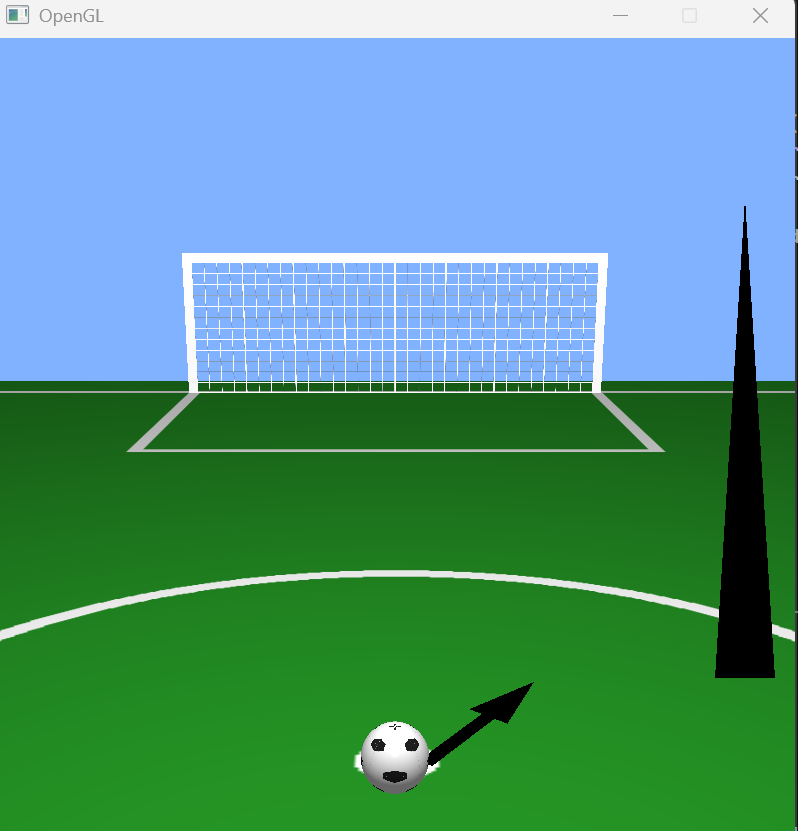
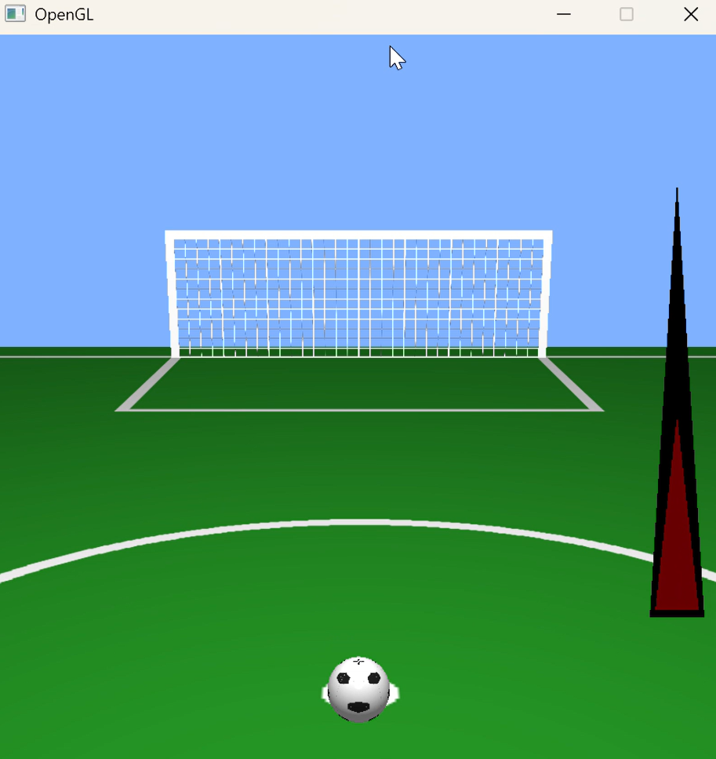
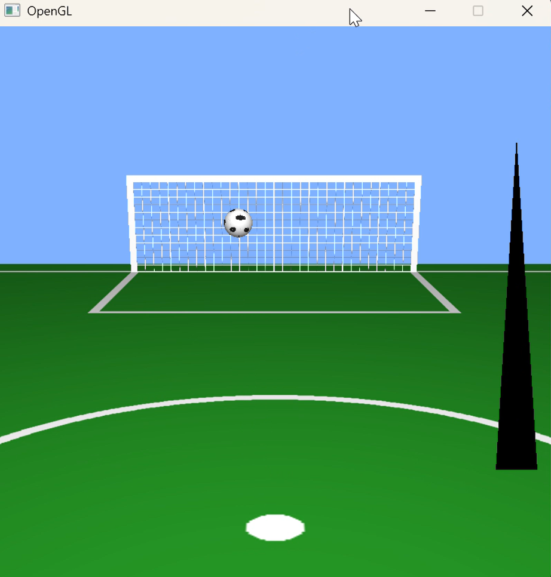
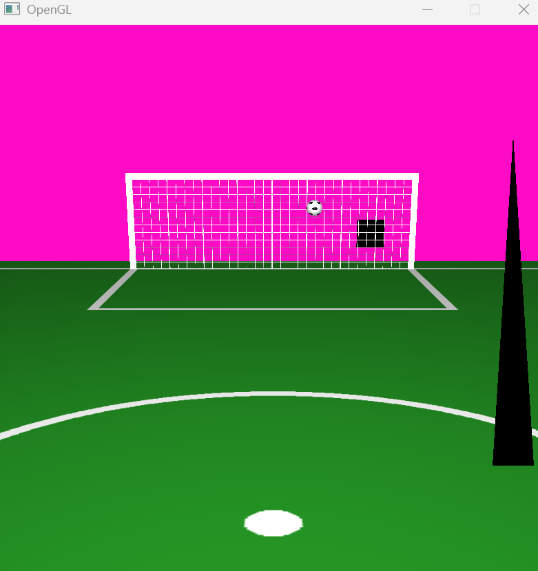
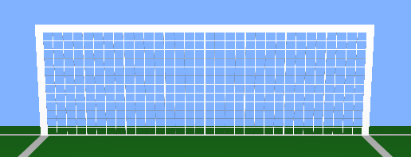
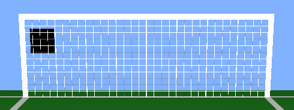

# RAPPORT DE PROJET : SIMULATION DE TIRS AU BUT EN 3D

## 1. Introduction & Objectifs
Ce projet consiste à développer une application 3D interactive temps réel simulant une séance de tirs au but. Développée en Python à l'aide des librairies GLFW, NumPy et Pyrr, l'application s'appuie sur le pipeline programmable d'OpenGL 3.3 Core Profile.

L'objectif est d'implémenter :
* Un rendu réaliste et tridimensionnel d'un terrain de football, d'un ballon et d'une cage de but.
* Un système d'interaction combinant une visée angulaire oscillante et une jauge de puissance.
* Une simulation physique rigoureuse intégrant la gravité, les forces de frottement et les lois de rebond.
* Un éclairage dynamique basé sur le modèle de réflexion de Phong.
* Une mécanique de jeu évolutive par l'apparition d'obstacles dynamiques à éviter dans la cage.

---

## 2. Architecture Globale de l'Application
L'application est structurée est découpée en trois phases distinctes :

1. **Initialisation (`__init__` & `init_data`) :** Configuration de la fenêtre graphique, activation des fonctionnalités OpenGL (test de profondeur, mélange alpha), compilation des shaders, génération des structures de données de sommets (VBO/VAO) et chargement des textures en mémoire GPU.
2. **Boucle de rendu (`run`) :** Calcul du temps de boucle ($dt$), exécution des équations de mouvements physiques, gestion des collisions, mise à jour des matrices de transformation et émission des requêtes de dessin (`glDrawElements`, `glDrawArrays`).
3. **Gestion des événements (`key_callback`) :** Interception des actions clavier pour piloter les états du jeu : `VISER` $\rightarrow$ `CHARGER` $\rightarrow$ `TIR`.

---

## 3. Modélisation Géométrique et Structuration de la Scène

### 3.1. Organisation du repère global
L'univers 3D est défini selon un repère orthonormé standard. Le sol (pelouse) est modélisé par un plan horizontal fixe à l'ordonnée $Y = -1.2$. 

Afin d'obtenir des proportions cohérentes et de respecter les contraintes de perspective, les dimensions et les positions initiales des entités ont été rigoureusement coordonnées :
* **Le Sol :** S'étend de $X \in [-25.0, 25.0]$ et $Z \in [5.0, -35.0]$.
* **Le Ballon :** Rayon fixé à $R = 0.4$. Sa position initiale sur le point de penalty est définie à $Z = -9.0$. Pour affleurer parfaitement la pelouse sans interpénétration, sa coordonnée verticale est calculée dynamiquement par : $Y = Y_{sol} + R = -1.05$.
* **La Cage :** Positionnée au fond du terrain, calée sur la ligne de but blanche de la texture à $Z = -32.7$.

### 3.2. Structuration géométrique de la cage de but
Le maillage (`sommets_cage`) a été divisé en 4 entités géométriques distinctes partageant un unique VAO. Les coordonnées locales ont été définies pour refléter des dimensions réalistes (Largeur : $10.0$ unités, Hauteur : $3.5$ unités) :

| Sous-entité | Plage X (Largeur locale) | Plage Y (Hauteur locale) | Propriété visuelle |
| :--- | :--- | :--- | :--- |
| **Poteau Gauche** | $[-7.32, -7.02]$ | $[0.0, 3.5]$ | Couleur blanche opaque (sans texture) |
| **Poteau Droit** | $[7.02, 7.32]$ | $[0.0, 3.5]$ | Couleur blanche opaque (sans texture) |
| **Barre Transversale** | $[-7.02, 7.02]$ | $[4.58, 4.88]$ | Couleur blanche opaque (sans texture) |
| **Filet Central** | $[-7.02, 7.02]$ | $[0.0, 4.58]$ | Texture `filet.png`|

Cette dissociation géométrique stricte permet d'isoler des boîtes de collision (Bounding Boxes) : un impact dans la zone du filet central validera le but.

### 3.3. Modélisation géométrique des obstacles dynamiques
Afin d'ajouter une contrainte de jeu, des obstacles plans de forme carrée et de couleur noire opaque ont été introduits dans l'embrasure de la cage de but. Chaque obstacle est généré à partir d'un maillage local de dimensions $1.4 \times 1.4$ unités (coordonnées locales de $-0.7$ à $+0.7$) :

Les sommets reçoivent une couleur noire fixe injectée dans le flux de données (`R,G,B = 0.0, 0.0, 0.0`) et pointent vers une texture unie blanche opaque (`self.texture_blanche`) pour garantir un rendu mat et homogène. Pour éviter les conflits d'interpénétration visuelle avec le filet, chaque obstacle est positionné sur l'axe de profondeur à $Z = -32.8$, soit exactement $10\text{ cm}$ en avant du filet ($Z = -32.9$).

---

## 4. Implémentation des Méthodes Physiques et Cinématiques

### 4.1. Cinématique de visée et chargement du tir
Le système de jeu repose sur une décomposition de l'action en trois états gérés dans le cycle principal :

* **État `VISER` :** L'angle de visée horizontal $\theta$ oscille de manière continue sous l'effet d'une fonction sinusoïdale dépendante du temps machine : $\theta(t) = \sin(t \cdot \text{vitesse}) \cdot \frac{\pi}{4}$. Une flèche noire unie est dessinée au sol pour matérialiser cette direction.
* **État `CHARGER` :** Initié par la pression continue de la touche `ESPACE`. L'angle de visée est verrouillé. Une variable de puissance `self.power` s'incrémente linéairement au fil du temps (plafonnée à $1.0$). Une jauge HUD (triangle rouge) s'élève à l'écran pour indiquer visuellement le niveau de charge.
* **État `TIR` :** Déclenché lors du relâchement de la touche `ESPACE`. La force finale du tir est calculée dynamiquement par interpolation : $\text{force} = 5.0 + (\text{self.power} \cdot 25.0)$. Le vecteur directionnel 3D normalisé est alors généré :

$$\vec{d} = \begin{pmatrix} \sin(\theta) \\ 0.6 \\ -\cos(\theta) \end{pmatrix}$$

Le vecteur vitesse initiale du ballon est initialisé par : $\vec{v} = \vec{d} \cdot \text{force}$.

### 4.2. Intégration physique de la trajectoire et rebonds
Lorsque le ballon est dans l'état `TIR`, sa position est mise à jour à chaque frame en appliquant le schéma d'intégration d'Euler explicite :

$$\vec{v}_{t+dt} = \vec{v}_t + \vec{g} \cdot dt$$
$$\vec{p}_{t+dt} = \vec{p}_t + \vec{v}_{t+dt} \cdot dt$$

Avec $\vec{g} = (0, -9.81, 0)$ le vecteur gravité et $dt$ le temps de boucle.
La collision avec le sol est traitée de manière analytique. Si $Y_{ballon} - R \le -1.2$, le traitement applique deux corrections immédiates :
1. **Inversion et amortissement vertical :** $v_y = -v_y \cdot 0.5$ (rebond semi-élastique).
2. **Friction horizontale :** $v_x = v_x \cdot 0.98$ et $v_z = v_z \cdot 0.98$ (friction sur la pelouse).

### 4.3. Calcul de l'axe de rotation dynamique du ballon
La rotation de la texture sur la sphère a été mathématiquement liée à sa direction de déplacement. L'axe de rotation $\vec{a}$ doit être perpendiculaire au vecteur de vitesse horizontale $\vec{v}_{xz} = (v_x, 0, v_z)$ et au vecteur vertical du monde $\vec{u} = (0, 1, 0)$. Il est extrait à chaque frame par un produit vectoriel :

$$\vec{a} = \vec{v}_{xz} \times \vec{u} = \begin{pmatrix} v_x \\ 0 \\ v_z \end{pmatrix} ∧ \begin{pmatrix} 0 \\ 1 \\ 0 \end{pmatrix} = \begin{pmatrix} -v_z \\ 0 \\ v_x \end{pmatrix}$$

Après normalisation de l'axe $\vec{a}$, la matrice de rotation correspondante (`create_from_axis_rotation`) est multipliée à gauche de la matrice de translation. Cette méthode garantit que les hexagones du ballon roulent parfaitement dans le sens de la trajectoire.

### 4.4. Algorithme de détection de collision Ballon-Obstacle
La détection d'impact entre le ballon (modélisé par une sphère mobile) et les obstacles (modélisés par des carrés de $1.0 \times 1.0$ unité en coordonnées physiques) est exécutée à chaque frame dans l'état `TIR` dès que le ballon franchit le plan de but à $Z \le -32.9$.

L'algorithme implémente une vérification par boîte de collision englobante. Le rayon du ballon ($R = 0.4$) est additionné à la demi-largeur de l'obstacle ($0.5$) pour simuler un contact physique dès que la périphérie de la sphère intercepte le carré :

L'encadrement mathématique pour valider une collision avec un obstacle donné est défini par le système d'inéquations suivant :

$$\begin{cases} 
X_{obs} - 0.5 - R \le X_{ballon} \le X_{obs} + 0.5 + R \\
Y_{obs} - 0.5 - R \le Y_{ballon} \le Y_{obs} + 0.5 + R 
\end{cases}$$

Si la position $(X, Y)$ du ballon valide cet encadrement, la variable `touche_obstacle` bascule à `True`. Le tir est alors invalidé et l'application réinitialise la machine à états vers l'état `VISER`.

### 4.5. Logique de jeu et génération procédurale
Lorsqu'un tir est cadré et qu'aucune collision avec un obstacle n'est détectée, le score est incrémenté. L'état bascule vers `BUT` (déclenchant l'effet de clignotement de l'arrière-plan par variation sinusoïdale des composantes RGB du `glClearColor`).

Pendant cette phase, le script génère procéduralement un nouvel obstacle dans la cage à l'aide de coordonnées aléatoires uniformes :
* $X_{obs} \in [-6.5, 6.5]$ (l'obstacle reste à l'intérieur des poteaux situés à $\pm 7.32$).
* $Y_{obs} \in [-0.5, 3.0]$ (l'obstacle reste sous la barre transversale située à $4.88$).

Ce mécanisme augmente progressivement la difficulté du jeu après chaque but marqué.

---

## 5. Pipeline Graphique, Gestion des Shaders et Matrice de Textures

### 5.1. Modèle d'illumination et gestion de l'ombre globale
Le rendu s'appuie sur le modèle d'éclairage local de **Phong**.

Pour corriger le problème initial où l'ensemble de la scène se situait dans la pénombre, la source de lumière a été retirée du premier plan et repositionnée en haut à des coordonnées simulant un projecteur de stade : $\text{LightPos} = (0.0, 10.0, -5.0)$. La composante ambiante du shader a été rehaussée à `0.4` pour assurer une bonne visibilité des faces sombres.

### 5.2. Gestion sélective de la transparence (Blending)
L'intégration d'un filet de but réaliste nécessite l'utilisation d'une texture comportant un canal de transparence (`filet.png`). L'activation globale du mélange alpha (`GL_BLEND`) provoquait des soucis visuels.

Pour résoudre ce problème, le pipeline applique une activation sélective du Blending au cours de la boucle d'affichage :
1. `glDisable(GL_BLEND)` est appelé avant le dessin du terrain, de la flèche, des obstacles et du ballon (objets opaques).
2. `glEnable(GL_BLEND)` est activé spécifiquement avant le dessin de la cage, avec `glBlendFunc(GL_SRC_ALPHA, GL_ONE_MINUS_SRC_ALPHA)`. Les mailles du filet se dessinent en blanc, tandis que les pixels transparents laissent voir l'arrière-plan.

### 5.3. Rendu de l'interface utilisateur (HUD)
L'affichage de la jauge de puissance nécessite de s'affranchir des transformations de la caméra 3D. Avant le dessin des triangles de la jauge (VAO noir et rouge), le test de profondeur est désactivé (`glDisable(GL_DEPTH_TEST)`). Les matrices de projection et de vue sont écrasées par des matrices d'identité. Les sommets de la jauge sont ainsi directement spécifiés en coordonnées normalisées, garantissant qu'ils soient fixes au premier plan.

---

## 6. Conclusion et Perspectives
Ce projet a permis de concrétiser les concepts fondamentaux du pipeline programmable d'OpenGL. La structuration rigoureuse de la scène et la maîtrise des matrices de transformation ont donné une application de simulation physique fluide, interactiven et qui évolue au fil du temps.

Les perspectives futures incluent l'ajout d'un calcul de rebond physique élaboré sur les poteaux (en combinant le maillage de la cage), ainsi que l'intégration d'un gardien de but animé par une intelligence artificielle rudimentaire pour enrichir l'expérience de jeu.